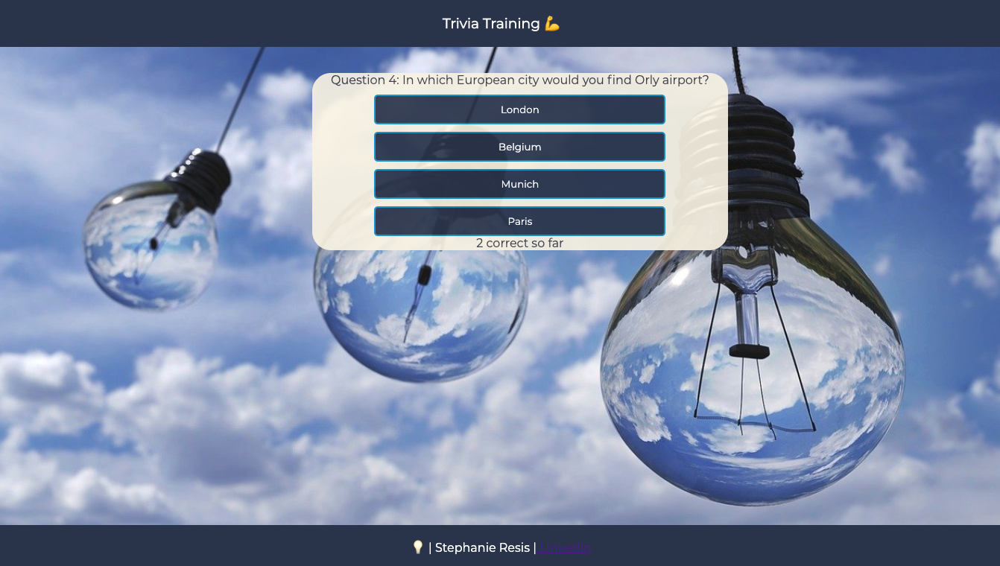
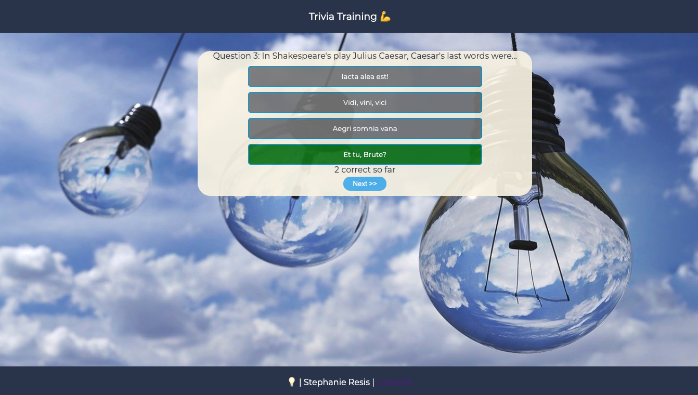
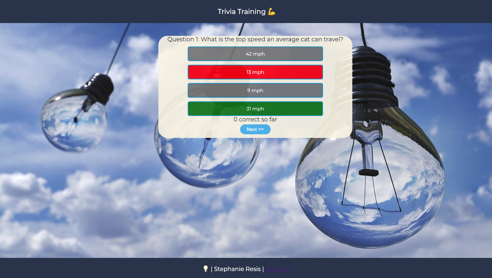

## Description

Trivia app where players can answer multiple-choice questions, see the correct answer, and track their score. Each trivia round features 10 unique questions. 

## Tech Stack

- React
- JavaScript
- HTML
- CSS

## Features

#### View Questions
Players can view one question at a time (out of a 10 question round) and its corresponding multiple choice options.
 

#### View Correct Answer
After clicking on an option, the player can immediately see if they were correct. The cumulative correct answer count is shown at the bottom and is updated in real time. Upon clicking an option, all of the option buttons are disabled, and the next button appears and the player can proceed to the next question when they are ready. 

If the player is correct, their selection will appear green.

If the player is incorrect, their selection will appear red and the correct answer will appear green.


#### See Final Score and Play Again
After completing the trivia round, players can see their score and start a new game.


## Getting Started

- Clone the repository
```bash
git clone https://github.com/sresis/Trivia-Training-App.git
```
- Install requirements
```bash
pip3 install -r requirements.txt
```
- In the project directory, run:

```bash
npm install
```
- Next, run:
```bash
npm start
```

Runs the app in the development mode.\
Open [http://localhost:3000](http://localhost:3000) to view it in the browser.

The page will reload if you make edits.\
You will also see any lint errors in the console.


